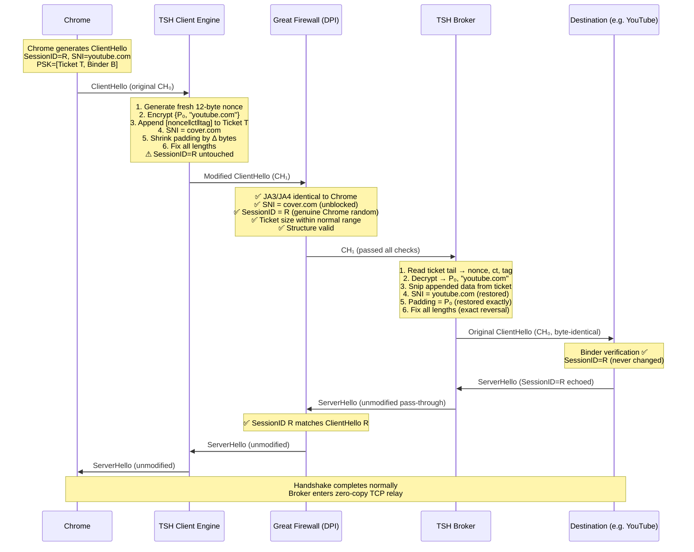

# TSH (Transparent Single-Handshake) Broker

**Author:** Bingchen Gong ([@Wenri](https://github.com/Wenri))

A next-generation censorship evasion architecture that hides routing data inside TLS 1.3 PSK session tickets. TSH modifies only opaque, variable-length fields in the ClientHello, passes all known DPI checks, and reconstructs the original packet at the broker — delivering a byte-identical ClientHello to the destination server. The broker is **100% stateless** after forwarding: no return-path interception required.

> [!NOTE]
> This is a **design specification** (v4), not production software. The v4 architecture resolves three critical flaws discovered in v3: an HRR nonce-reuse key leak, a padding ambiguity bug, and a stateful ServerHello bottleneck.

---

## How It Works

TSH exploits the fact that TLS 1.3 PSK session tickets are **opaque, variable-length blobs** that DPI systems cannot validate. The client appends encrypted routing data to the PSK ticket, spoofs the SNI to a cover domain, and adjusts padding to absorb length changes. The broker decrypts the ticket tail, learns the true destination, perfectly reverses all modifications, and forwards a byte-identical ClientHello. Because `legacy_session_id` is never modified, the destination server's ServerHello echo naturally matches — no return-path patching needed.



### Key Difference from v3

| Property | v3 (Session ID Injection) | v4 (Direct Ticket Injection) |
|---|---|---|
| Carrier field | `legacy_session_id` (32 bytes fixed) | PSK ticket tail (variable, unbounded) |
| `legacy_session_id` | Overwritten with ciphertext | **Untouched** |
| ServerHello patching | Required (bidirectional) | **Not needed** |
| Broker statefulness | Stateful (must remember ciphertext C) | **100% stateless** |
| AEAD tag | 8 bytes (truncated) | **16 bytes (full)** |
| Nonce | `client_random[0:12]` (HRR-unsafe) | **Fresh 12-byte CSPRNG** |
| Payload capacity | 24 bytes (tight) | **Unlimited** |
| Cover domain pool | Multiple length-matched domains | **Single domain** |
| Padding restoration | Ambiguous (client/server mismatch) | **Explicit P₀ in payload** |

---

## Architectural Components

### Part 1: Cryptographic Specification

| Parameter | Value | Rationale |
|---|---|---|
| **AEAD** | ChaCha20-Poly1305 | Full security, natively supported in Go/Rust, immune to Ferguson's short-tag attack |
| **Tag** | 16 bytes (full) | Unbounded ticket space eliminates need for truncation |
| **Nonce** | Fresh 12-byte CSPRNG per connection | Immune to HRR nonce-reuse (RFC 8446 §4.1.2 mandates same `client_random` across HRR) |
| **Key** | 256-bit per-user PSK | Distributed out-of-band |

#### Encrypted Routing Data (ERD) — Appended to PSK Ticket

```
┌──────────────┬────────────────────────────────┬──────────────────┬────────────────┐
│  Nonce (12B) │  Ciphertext (variable)         │  Auth Tag (16B)  │  Length (2B)   │
└──────────────┴────────────────────────────────┴──────────────────┴────────────────┘
```

The 2-byte **length trailer** at the end lets the broker read the last 2 bytes of the PSK identity opaque data to immediately determine the ERD size. Total: `30 + len(plaintext)` bytes (e.g., 44 bytes for `youtube.com`).

#### Plaintext Payload (inside ciphertext)

```
Offset  Length  Field
──────  ──────  ─────────────────────────────
0       2       Original padding length (P₀), big-endian
2       var     Target domain string (null-terminated ASCII)
                No length limit — ticket space is unbounded
```

> [!TIP]
> With unbounded payload space, there is no need for Huffman compression, dictionary modes, or IPv4/IPv6 encoding. The domain is simply stored as a null-terminated ASCII string. Even `r4---sn-ab5l6nzs.googlevideo.com` (34 bytes) fits trivially.

### Part 2: Client-Side Engine

The client engine runs locally (TUN interface or SOCKS5 local port) and operates **below** Chrome's TLS stack, modifying serialized bytes on the wire.

#### Activation Logic

```
ECH available and not stripped?  → Pass through (no TSH needed)
PSK extension present?           → TSH active
PSK extension absent?            → Fallback to outer tunnel (VLESS/Trojan)
```

#### Step-by-Step Transformation

1. **Parse**: Walk the ClientHello to locate SNI extension, padding extension, and PSK extension (must be last)
2. **Record padding**: Save the current padding extension data length as `P₀` (0 if no padding extension)
3. **Encrypt**: Generate a fresh 12-byte CSPRNG nonce. Encrypt `{P₀ ‖ target_domain ‖ NUL}` with ChaCha20-Poly1305 → ciphertext + 16-byte tag. Construct ERD = `nonce ‖ ciphertext ‖ tag ‖ u16_be(erd_total_len)`
4. **Append to ticket**: Append ERD to the first PSK identity's opaque data
5. **Spoof SNI**: Overwrite SNI hostname with cover domain
6. **Compute delta**: `Δ = len(ERD) + len(cover_domain) - len(target_domain)` (equivalently, `Δ = erd_len + Δ_SNI`)
7. **Absorb with padding**: If padding extension exists and `P₀ ≥ Δ`: shrink padding by `Δ` → net packet size change = 0. Otherwise: set padding to 0 (or remove extension), accept net growth
8. **Fix lengths**: Update PSK identity length (+ERD), PSK extension length, SNI internal lengths, padding extension length, extensions total, handshake length, TLS record length
9. **Transmit**: Forward through the censored network

> [!IMPORTANT]
> **`legacy_session_id` is never modified.** Chrome's original random value `R` passes through untouched. This eliminates the ServerHello echo mismatch entirely.

#### HRR Safety

If Chrome receives a `HelloRetryRequest` and sends a second ClientHello:
- `client_random` remains the same (RFC 8446 §4.1.2 mandate)
- The TSH client engine generates a **new fresh 12-byte nonce** for the new encryption
- No nonce reuse occurs — each Transform uses an independent CSPRNG nonce
- The new ClientHello is re-processed by TSH independently

### Part 3: Wire Analysis (DPI Evasion)

| DPI Check | Result | Why |
|---|---|---|
| JA3/JA4 fingerprint | ✅ Pass | Extension IDs, cipher list, curve list unchanged |
| SNI filter | ✅ Pass | Reads cover domain (unblocked, broker-controlled) |
| Entropy analysis on Session ID | ✅ Pass | Session ID = Chrome's genuine random `R` (never modified) |
| Stateful CH↔SH correlation | ✅ Pass | `R` in ClientHello, `R` echoed in ServerHello — natural match |
| PSK ticket size | ✅ Pass | Tickets are 100–500B normally; +44B growth (typical) is within variance |
| Packet size | ✅ Pass | Padding absorption keeps total size constant (when padding ≥ Δ) |
| Certificate inspection | ✅ N/A | Server Certificate is encrypted in TLS 1.3 |

### Part 4: Server-Side (Broker) Engine

1. **Locate PSK ticket**: Parse ClientHello to find the first PSK identity
2. **Read ERD length from ticket tail**: Last 2 bytes of identity opaque data → `erd_total_len`. Read backward to extract nonce (12B), ciphertext (variable), and Poly1305 tag (16B)
3. **Decrypt**: Using the per-user PSK key and the 12-byte nonce from the ERD, decrypt and verify the 16-byte Poly1305 tag. **On failure** → serve real website for cover domain (active probe defense)
4. **Extract routing**: Read `P₀` (2 bytes) and target domain from plaintext
5. **Snip ERD**: Remove the appended bytes from the PSK identity, restore identity length
6. **Restore SNI**: Overwrite cover domain with target domain, fix SNI internal length fields
7. **Restore padding**: Set padding extension data length to exactly `P₀`. If `P₀ = 0` and padding extension was removed by client, the broker must also have removed it (or it was never present)
8. **Fix lengths**: Exact reversal — PSK extension, extensions total, handshake, TLS record
9. **Forward**: Open TCP to destination, send byte-identical `CH₀`
10. **Zero-copy relay**: All subsequent data (ServerHello, certificates, application records) is relayed as raw TCP with **no inspection or modification**

> [!IMPORTANT]
> The broker is **100% stateless** after step 9. It does not need to remember any per-connection cryptographic material. It can use zero-copy kernel forwarding (`splice()`, `sendfile()`) for maximum throughput.

### Part 5: Cover Domain Strategy

TSH v4 requires only **one** cover domain. Length mismatches between the cover domain and the target domain are absorbed by dynamic padding adjustment.

| Requirement | Detail |
|---|---|
| Broker-controlled | Operator registers the domain and obtains a legitimate certificate |
| Real website served | Defeats active probing — failed MAC → genuine TLS handshake + real HTTP response |
| CDN/cloud hosted | IP must plausibly host the cover domain |
| TLS 1.3 + PSK | Cover domain must support session resumption |

**Single domain example:** `api.com` — short (7 bytes), plausible, operator-controlled.

---

## Security Analysis

### Formal Correctness

The entire protocol security reduces to a single testable invariant:

> **`Restore(Transform(CH₀)) ≡ CH₀`** (byte-identity)

**Proof that binder verification succeeds:**

Let `CH₀` = Chrome's original ClientHello. Chrome computes `B = HMAC(binder_key, Hash(Truncate(CH₀)))`. The broker restores `CH₂ = Restore(Transform(CH₀))`. If `CH₂ = CH₀` byte-for-byte, then `Hash(Truncate(CH₂)) = Hash(Truncate(CH₀))`, therefore `B` verifies at the destination. ∎

The explicit `P₀` in the payload **mathematically guarantees** padding restoration — the broker never has to guess what the client did.

### Threat Model

| Threat | Defense | Residual Risk |
|---|---|---|
| SNI filtering | Broker-controlled cover domain | Cover domain blocked (rotate) |
| JA3/JA4 fingerprint | Preserved (no extension changes) | None |
| Entropy analysis | Session ID is genuine Chrome random | None |
| Stateful DPI (CH↔SH) | Session ID never modified — natural match | None |
| Active probing | Real website on cover domain (IUAP) | Probe sophistication |
| IP-domain mismatch | CDN/cloud deployment | Infrastructure cost |
| Ticket size anomaly | +44B within 100–500B normal variance | Statistical profiling against cover domain ticket sizes |
| Static broker IP | CDN/cloud hosting, domain rotation | IP blocklisting (**shared with XTLS Reality**) |
| Tag forgery | Full 16-byte Poly1305 tag (2⁻¹²⁸) | Negligible |
| HRR nonce reuse | Fresh CSPRNG nonce per Transform | None |
| Key compromise | Per-user PSK, periodic rotation | Bootstrap (universal) |
| Chrome drops compat mode | Only affects Session ID (unused in v4); PSK tickets remain | Low |
| GFW strips PSK extension | Kill condition — no mitigation | Critical |

### Comparison with Alternatives

| Approach | Stealth | Complexity | GFW Resistance (2026) |
|---|---|---|---|
| ECH (RFC 9330) | ★★★★★ | ★☆☆☆☆ | ★★☆☆☆ (actively stripped) |
| TLS Record Fragmentation | ★★★☆☆ | ★★☆☆☆ | ★★★☆☆ (detectable by stateful DPI) |
| Domain Fronting | ★★★★☆ | ★★☆☆☆ | ★☆☆☆☆ (disabled by CDNs) |
| VLESS/Trojan over TLS | ★★★☆☆ | ★★★☆☆ | ★★★☆☆ (active probing risk) |
| XTLS Reality | ★★★★☆ | ★★★☆☆ | ★★★★☆ (timing/cert mimicry risk) |
| **TSH v4** | ★★★★★ | ★★★★☆ | ★★★★☆ (novel, no known detection) |

#### ECH Limitations

- **DNS distribution dependency**: ECH requires DNS-over-HTTPS (DoH) or DNS-over-TLS (DoT) to distribute HPKE public keys. In censored networks, encrypted DNS resolvers are routinely blocked, severing ECH's key distribution mechanism. TSH uses an out-of-band, static Pre-Shared Key — no DNS dependency.
- **Extension identifiability**: ECH uses a distinct, officially designated extension type (`0xFE0D`), trivially identifiable by passive DPI. State censors can drop any packet containing this extension. TSH hides routing data in the standard PSK extension (`0x0029`), which is ubiquitous in legitimate session resumption — blocking it would degrade a vast percentage of benign traffic.
- **Corporate pushback**: Enterprise security vendors are actively lobbying against ECH adoption due to lost visibility for malware/phishing detection, accelerating deployment of ECH-stripping middleboxes.

#### XTLS Reality Comparison

- **Mimicry fragility**: Reality requires the proxy to mimic the exact certificate, timing behavior, and cipher suite selections of a legitimate server. Subtle discrepancies in response latency or TLS extension ordering can expose the proxy to fingerprinting. TSH eliminates mimicry risk entirely — the actual destination server handles all cryptographic negotiation.
- **Shared IP vulnerability**: Both TSH and Reality rely on static proxy/broker IP addresses. If discovered through traffic analysis or behavioral correlation, the IP can be blocklisted at the national firewall. This is the most fundamental architectural weakness shared by both approaches.

---

## Known Fragilities

### Engineering (High Risk)

- **Byte-identity restoration**: Any mismatch in length field arithmetic or PSK ticket boundary snipping silently kills the connection
- **`obfuscated_ticket_age` boundary**: The 4-byte field immediately follows each PSK identity opaque data. Ticket manipulation must not corrupt this boundary
- **PSK size statistical anomaly**: Real-world TLS implementations (OpenSSL, BoringSSL, NSS) produce session tickets of highly specific, tightly distributed sizes. The uniform addition of ~44 bytes to the PSK identity creates a detectable statistical deviation when DPI profiles ticket sizes for the cover domain. A censor need not decrypt the ChaCha20 payload — the length anomaly alone is a viable heuristic trigger.
- **Padding exhaustion and TLS record divergence**: When `P₀ < Δ_total`, the packet must grow. State censors maintain databases mapping ClientHello record lengths to specific browser User-Agent strings. A forced expansion breaks the expected size correlation, enabling length-based fingerprinting even when JA3/JA4 hashes remain intact.

### Protocol Evolution (Medium Risk)

- **GFW deploys PSK stripping**: If the GFW strips the PSK extension entirely, the ERD is destroyed. This is a kill condition with no mitigation
- **Chrome changes extension order**: Chrome randomizes extension order via GREASE. TSH must parse extensions dynamically
- **Middlebox PSK stripping**: Enterprise firewalls and TLS Intercept Applications (TIAs) may strip the PSK extension to enforce full handshakes (suppressing 0-RTT for security policy). If such a middlebox exists anywhere in the path between client and broker, the ERD is catastrophically destroyed and the broker falls back to serving the cover website. This risk exists even outside censored networks.

### Operational (Low Risk)

- **0-RTT anti-replay rejection**: Some CDN edge servers reject resumed connections. The broker relays the `HelloRetryRequest` back through the tunnel for Chrome to retry. The TSH engine generates a fresh nonce for the new ClientHello — no crypto risk
- **Multi-ticket PSK**: Recommend using the **first** identity for simplicity (most reliable parsing)

---

## Operational Mode Hierarchy

```
1. ECH available and working?     → Use ECH natively (no TSH)
2. ECH stripped by GFW?           → Activate TSH
3. No PSK ticket (first contact)? → Fallback to outer tunnel (VLESS/Trojan)
4. Outer tunnel establishes TLS   → Chrome caches session ticket
5. Subsequent connections         → TSH active
```

TSH is an **optimization layer** on top of a standard tunnel, not a standalone solution.

---

## Future Directions

Research directions for evolving TSH beyond v4 — including ECH resurrection, bucketized padding, PSK ticket steganography, refraction networking integration, and hardware DPI countermeasures — are developed in [`docs/future.md`](docs/future.md).

---

## Verification Plan

### Transform/Restore Test Harness (Mandatory)

```
Phase 1: Capture real Chrome ClientHello packets (1000+ from various sites)
Phase 2: For each CH₀: Assert Restore(Transform(CH₀)) == CH₀ byte-for-byte
Phase 3: Forward restored CH₂ to actual destination, verify handshake completes
Phase 4: Fuzz test with varying SNI lengths, ticket counts, padding sizes
Phase 5: HRR simulation — force HRR, verify fresh nonce used, no key leak
```

### Active Probe Resistance Test

```
1. Connect to broker with random bytes → verify real website served
2. Connect with valid TLS but wrong MAC → verify real website served
3. Connect with replayed ClientHello → verify graceful handling
```

---

## Configuration

Client configuration via URI scheme:

```
tsh://broker.example.com?key=base64url(PSK)&cover=api.com
```

| Parameter | Description |
|---|---|
| `host` | Broker server address |
| `key` | Base64url-encoded 256-bit per-user PSK |
| `cover` | Single cover domain (no pool needed) |

---

## Open Questions

1. **Implementation language**: Go (mature anti-censorship ecosystem: `utls`, Xray, Sing-box) vs. Rust (memory safety)?
2. **Build order**: Test harness first → stateless broker engine → client engine?
3. **ECH resurrection**: Should this be a v4.1 feature or deferred to v5? See [`docs/future.md` §3.3](docs/future.md) for detailed design.
4. ~~**ERD length signaling**~~: **Resolved** — the ERD uses a 2-byte length **trailer** at the very end (after the Poly1305 tag). The broker reads the last 2 bytes of the PSK identity opaque data to learn the ERD size, then reads backward to extract nonce, ciphertext, and tag. See `docs/implementation_plan.md` §5.1 for the definitive layout.
