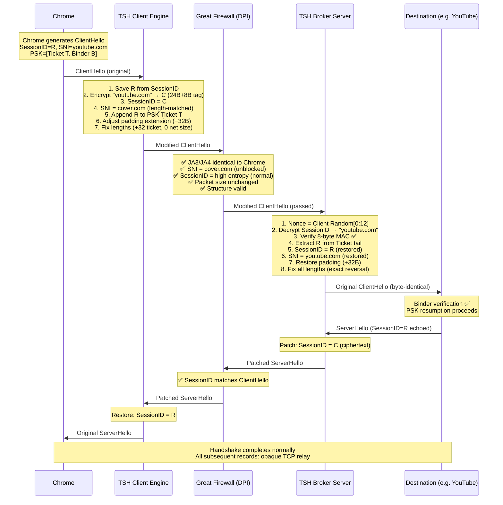

# TSH (Transparent Single-Handshake) Broker

**Author:** Bingchen Gong ([@Wenri](https://github.com/Wenri))

A theoretical next-generation censorship evasion architecture that hides routing data inside TLS 1.3 session-resumption handshakes. TSH modifies the ClientHello's opaque fields on the wire, passes all known DPI checks, and reconstructs the original packet at the broker — delivering a byte-identical ClientHello to the destination server.

> [!NOTE]
> This is a **design specification**, not production software. The architecture has undergone three rounds of review. This document reflects the v3 consolidated analysis.

---

## How It Works

TSH exploits the fact that TLS 1.3's middlebox-compatibility mode fills `legacy_session_id` with 32 bytes of random noise and that PSK session tickets are opaque, variable-length blobs. By replacing the random noise with encrypted routing data and temporarily hiding the original bytes inside a PSK ticket, the broker creates a ClientHello that is indistinguishable from Chrome's genuine traffic at every layer a censor can inspect.



---

## Architectural Components

### Part 1: Cryptographic Specification

| Parameter | Value | Rationale |
|---|---|---|
| **AEAD** | GCM-SST (primary) or ChaCha20-Poly1305 | GCM-SST resists Ferguson's subkey-recovery attack on short tags |
| **Tag** | 8 bytes | 2^{-64} forgery probability per probe (GCM-SST). Standard GCM's `n × 2^{-t}` degradation and subkey leakage make 4-byte tags inadvisable |
| **Nonce** | Client Random\[0:12\] (12 bytes) | Publicly visible but unique per connection; zero on-wire overhead |
| **Payload** | 24 bytes | Encrypted destination routing data |
| **Key** | 256-bit per-user PSK | Distributed out-of-band via `tsh://` URI |

#### Session ID Layout (32 bytes)

```
┌────────────────────────────────┬──────────────────┐
│   Encrypted Payload (24 B)     │   Auth Tag (8 B) │
└────────────────────────────────┴──────────────────┘
```

#### Payload Encoding (24 bytes, replacing custom Huffman)

```
Byte 0:       Flags
              [0:1] Mode: 00=Raw ASCII  01=Dictionary  10=IPv4  11=IPv6
              [2]   Port: 0=443 (implicit)  1=explicit 2-byte port follows
              [3:7] Reserved

Bytes 1-23:   Mode-dependent
              Raw:   Domain string, null-terminated (≤23 chars, covers ~95% of domains)
              Dict:  2-byte index (65,536 entries) + random padding
              IPv4:  4-byte addr + optional port + padding
              IPv6:  16-byte addr + optional port + padding
```

> [!TIP]
> Domains >23 characters (e.g., `r4---sn-ab5l6nzs.googlevideo.com`) use Dictionary mode. The dictionary is shared via PSK configuration. This avoids the complexity and version-coupling risk of a custom Huffman codec.

### Part 2: Client-Side Engine

The client engine runs locally (TUN interface or SOCKS5 local port) and operates **below** Chrome's TLS stack, modifying serialized bytes on the wire.

#### Activation Logic

```
ECH available and not stripped?  → Pass through (no TSH needed)
PSK extension present?           → TSH active
PSK extension absent?            → Fallback to outer tunnel (VLESS/Trojan)
```

#### Step-by-Step Transformation

1. **Parse**: Identify `legacy_session_id`, SNI extension, PSK extension, padding extension
2. **Extract**: Save the 32-byte Session ID (`R`) to a temporary variable
3. **Encrypt**: Compress target domain → 24 bytes. Encrypt with GCM-SST using `Client Random[0:12]` as nonce → 24 bytes ciphertext + 8 bytes tag = 32 bytes
4. **Inject**: Write 32-byte ciphertext into `legacy_session_id`
5. **Spoof SNI**: Overwrite SNI hostname with length-matched cover domain (Δ = 0 bytes)
6. **Hide originals**: Append `R` (32 bytes) to the first PSK ticket identity's opaque data
7. **Compensate padding**: If padding extension exists and padding ≥ 32 bytes, reduce by 32 to maintain total ClientHello size
8. **Fix lengths**: Increase PSK identity length +32, PSK extension total length +32, adjust extensions/handshake/record lengths (net +32 from ticket, −32 from padding = 0 with length-matched SNI)
9. **Transmit**: Forward through the censored network

#### ServerHello Interception (Return Path)

When the patched ServerHello arrives from the broker:
1. Read `legacy_session_id` (contains ciphertext `C`)
2. Replace with original `R` (saved from step 2)
3. Pass to Chrome — TLS handshake continues normally

### Part 3: Wire Analysis (DPI Evasion)

| DPI Check | Result | Why |
|---|---|---|
| JA3/JA4 fingerprint | ✅ Pass | Extension IDs, cipher list, curve list unchanged |
| SNI filter | ✅ Pass | Reads `cover.com` (unblocked, broker-controlled) |
| Entropy analysis | ✅ Pass | Session ID = 32 bytes high-entropy (identical to Chrome's random) |
| Packet size | ✅ Pass | Padding compensation keeps total size constant |
| Stateful CH↔SH correlation | ✅ Pass | ServerHello Session ID patched to match ClientHello |
| PSK ticket size | ✅ Pass | +32 bytes within normal variance (tickets are 100–500B) |
| Certificate inspection | ✅ N/A | Server Certificate is encrypted in TLS 1.3 |

### Part 4: Server-Side Engine

1. **Authenticate**: Read `Client Random[0:12]` as nonce, read 32-byte Session ID, verify 8-byte MAC. On failure → serve real website for cover domain (not a dead drop)
2. **Decrypt**: Recover true destination from 24-byte payload
3. **Extract hidden bytes**: Read PSK ticket identity, snip last 32 bytes (the original Session ID `R`)
4. **Restore Session ID**: Overwrite ciphertext with `R`
5. **Restore SNI**: Overwrite cover domain with true destination
6. **Restore padding**: Re-add 32 bytes of padding if applicable
7. **Fix lengths**: Exact reversal of client's adjustments
8. **Forward**: Open TCP to destination, send byte-identical ClientHello
9. **Patch ServerHello**: When destination responds, replace echoed `R` with ciphertext `C` in ServerHello's `legacy_session_id`
10. **Relay**: All subsequent TLS records are relayed as opaque TCP without modification

### Part 5: Cover Domain Strategy

> [!IMPORTANT]
> TSH does **not** impersonate third-party domains. The broker operator controls the cover domain.

| Requirement | Detail |
|---|---|
| Broker-controlled | Operator registers the domain and obtains a legitimate certificate |
| Length-matched pool | Multiple cover domains at different byte lengths |
| Real website served | Defeats active probing — failed MAC → genuine TLS handshake + real HTTP response |
| CDN/cloud hosted | IP must plausibly host the cover domain |
| TLS 1.3 + PSK | Cover domain must support session resumption (prevents "does this server support PSK?" probes) |

Example pool:

| Target Length | Cover Domain | Notes |
|---|---|---|
| 10 | mybooks.org | Matches `google.com` |
| 11 | mynotes.org | Matches `youtube.com` |
| 12 | myweather.io | Matches `facebook.com` |
| 14 | cloudnotes.io | Matches `instagram.com` |

---

## Security Analysis

### Formal Correctness

The entire protocol security reduces to a single testable invariant:

> **`Restore(Transform(CH₀)) ≡ CH₀`** (byte-identity)

**Proof that binder verification succeeds:**

Let `CH₀` = Chrome's original ClientHello. Chrome computes `B = HMAC(binder_key, Hash(Truncate(CH₀)))`. The TSH server restores `CH₂ = Restore(Transform(CH₀))`. If `CH₂ = CH₀` byte-for-byte, then `Hash(Truncate(CH₂)) = Hash(Truncate(CH₀))`, therefore `B` verifies at the destination. ∎

> [!WARNING]
> This invariant has **zero tolerance**. A single byte error in restoration causes silent binder verification failure at the destination. Mandatory test harness (see below) must validate this across thousands of real ClientHello packets.

### Threat Model

| Threat | Defense | Residual Risk |
|---|---|---|
| SNI filtering | Broker-controlled cover domain | Cover domain blocked (rotate) |
| JA3/JA4 fingerprint | Preserved (no extension changes) | None |
| Entropy analysis | Ciphertext ≡ random Session ID | None |
| Stateful DPI (CH↔SH) | Bidirectional ServerHello patching | Implementation error |
| Active probing | Real website on cover domain | Probe sophistication |
| IP-domain mismatch | CDN/cloud deployment | Infrastructure cost |
| Ticket size anomaly | +32B within normal variance | Statistical analysis |
| Tag forgery | GCM-SST 8-byte tag (2^{-64}) | Negligible |
| Key compromise | Per-user PSK, periodic rotation | Bootstrap (universal) |
| Chrome behavior changes | Version-specific test harness | Medium |
| ECH deployment | TSH is post-ECH-stripping fallback | ECH solves the problem |

### Comparison with Alternatives

| Approach | Stealth | Complexity | GFW Resistance (2026) |
|---|---|---|---|
| ECH (RFC 9330) | ★★★★★ | ★☆☆☆☆ | ★★☆☆☆ (actively stripped) |
| TLS Record Fragmentation | ★★★☆☆ | ★★☆☆☆ | ★★★☆☆ (detectable by stateful DPI) |
| Domain Fronting | ★★★★☆ | ★★☆☆☆ | ★☆☆☆☆ (disabled by CDNs) |
| VLESS/Trojan over TLS | ★★★☆☆ | ★★★☆☆ | ★★★☆☆ (active probing risk) |
| **TSH** | ★★★★★ | ★★★★★ | ★★★★☆ (novel, no known detection) |

---

## Known Fragilities

### Engineering (High Risk)

- **Byte-identity restoration**: The most critical engineering challenge. Any mismatch in length field arithmetic, SNI byte overwrite, or PSK ticket boundary snipping silently kills the connection
- **`obfuscated_ticket_age` boundary**: The 4-byte `obfuscated_ticket_age` field immediately follows each PSK identity. Ticket manipulation must not corrupt this boundary

### Protocol Evolution (Medium Risk)

- **Chrome drops compatibility mode**: If Chrome stops populating `legacy_session_id`, TSH loses its carrier field. No indication this will happen soon (middlebox compatibility remains necessary)
- **Chrome changes extension order**: Chrome randomizes extension order via GREASE. TSH must parse extensions dynamically, not rely on fixed offsets
- **GFW deploys PSK stripping**: If the GFW strips the PSK extension entirely, the hidden original Session ID is destroyed. This is a kill condition with no mitigation

### Operational (Low Risk)

- **0-RTT anti-replay rejection**: Some CDN edge servers reject resumed connections. The broker must absorb `HelloRetryRequest` and relay it through the tunnel for Chrome to retry with a new ClientHello (re-processed by TSH with the new Client Random as nonce)
- **Multi-ticket PSK selection**: Recommend using the **last** ticket identity for hidden storage. If a middlebox validates tickets, it is more likely to inspect the first one

---

## Operational Mode Hierarchy

```
1. ECH available and working?     → Use ECH natively (no TSH)
2. ECH stripped by GFW?           → Activate TSH
3. No PSK ticket (first contact)? → Fallback to outer tunnel (VLESS/Trojan)
4. Outer tunnel establishes TLS   → Chrome caches session ticket
5. Subsequent connections         → TSH active
```

TSH is an **optimization layer** on top of a standard tunnel, not a standalone solution. The first connection to any destination always uses the fallback tunnel.

---

## Verification Plan

### Transform/Restore Test Harness (Mandatory)

```
Phase 1: Capture real Chrome ClientHello packets (1000+ from various sites)
Phase 2: For each CH₀: Assert Restore(Transform(CH₀)) == CH₀ byte-for-byte
Phase 3: Forward restored CH₂ to actual destination, verify handshake completes
Phase 4: Fuzz test with varying SNI lengths, ticket counts, padding sizes
```

### Active Probe Resistance Test

```
1. Connect to broker with random bytes → verify real website served
2. Connect with valid TLS but wrong MAC → verify real website served
3. Connect with replayed ClientHello → verify connection handled gracefully
```

---

## Configuration

Client configuration via URI scheme:

```
tsh://broker.example.com?key=base64url(PSK)&covers=mynotes.org,mybooks.org,myweather.io
```

| Parameter | Description |
|---|---|
| `host` | Broker server address |
| `key` | Base64url-encoded 256-bit per-user PSK |
| `covers` | Comma-separated pool of cover domains (length-indexed) |

---

## Open Questions

1. **Implementation language**: Go (mature networking ecosystem) vs. Rust (memory safety)?
2. **GCM-SST availability**: Production-ready implementations in Go/Rust? Fallback to ChaCha20-Poly1305 with 8-byte truncated tag?
3. **Build order**: Test harness first (validate invariant) → server engine → client engine?
4. **Cover domain count**: How many domains at different byte lengths?
5. **ECH interaction**: Disable ECH when TSH is active, or attempt to operate on ECH's outer ClientHello?
