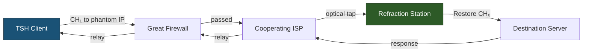

# TSH Broker — Research Directions and Future Architecture

**Author:** Bingchen Gong ([@Wenri](https://github.com/Wenri))

This document develops the strategic engineering directions for evolving TSH beyond v4. It consolidates the adversarial analysis, heuristic vulnerability assessment, and proposed mitigations from an external architectural verification report, verified against primary sources and extended with implementation considerations.

> [!NOTE]
> All proposals in this document are **research directions**, not committed specification changes. The v4 spec (`implementation_plan.md`) remains the authoritative engineering blueprint. Anything adopted here would enter a v4.1 or v5 specification cycle.

---

## §1. Adversarial Capability Baseline

### 1.1 Hardware-Accelerated Deep Packet Inspection

Modern state-level censors have fundamentally shifted DPI from software-based kernel processing to hardware-accelerated data-plane analysis. This eliminates any evasion strategy that relies on exhausting censor CPU.

**Architecture:**

```
┌──────────────────────────────────────────────────────────┐
│              National Gateway / ISP Edge                 │
│                                                          │
│  ┌──────────┐    escalate    ┌───────────────────────┐   │
│  │ P4 Switch│───────────────▶│ DPDK App (SmartNIC)   │   │
│  │ (ASIC)   │                │ (user-space, kernel-  │   │
│  │          │                │  bypass, HW regex)    │   │
│  └──────────┘                └───────────────────────┘   │
│   ≈1 µs/pkt                     ≈7 µs/pkt               │
│   SNI extraction                 Heuristic analysis      │
│   99% parse success rate         Pattern matching         │
└──────────────────────────────────────────────────────────┘
```

**Key metrics** (from Mazloum et al., U. South Carolina¹):

| Stage | Latency | Capability |
|---|---|---|
| P4 switch (data plane) | ~1 µs | Deterministic finite-state machine parser; extracts SNI from ClientHello at line rate; 99% parse success on real-world datasets |
| DPDK application (SmartNIC) | ~7 µs | User-space processing with direct NIC access; hardware regex engines for deep pattern matching; handles packets escalated from P4 |

**Implications for TSH:**

1. **CPU exhaustion is not viable** — evasion must rely on cryptographic indistinguishability and protocol conformance
2. **SNI extraction is near-perfect** — the cover domain SNI must be genuinely plausible; malformed or suspicious SNI values will be caught
3. **Heuristic analysis is fast enough for per-packet profiling** — statistical anomalies in ticket sizes or padding lengths can be flagged in real time

### 1.2 Active Probing Infrastructure

State censors (notably the GFW) deploy active probing networks that dynamically interrogate suspicious endpoints.² When passive DPI flags anomalous traffic, a controlled probe node initiates a secondary connection to the target server to map its behavioral response.

**TSH's existing defense** — Indistinguishability Under Active Probing (IUAP): the broker's Poly1305 MAC verification fails for any probe lacking valid credentials. Rather than terminating the connection (which would immediately flag the server), the broker seamlessly falls back to serving the genuine cover website via a standard TLS handshake.

**Residual risk:** Sophisticated probes may analyze behavioral timing (time-to-first-byte, TLS handshake latency) to distinguish the broker's fallback path from a genuine cover server. See §4.4 for timing normalization proposals.

### 1.3 TLS Fragmentation as Complementary Defense

A known evasion tactic against DPI systems that inspect only the first TCP segment of a TLS connection: split the ClientHello across multiple TCP segments.³ Most DPI systems lack the stateful memory to reassemble deeply fragmented handshakes across millions of concurrent connections — the SNI becomes invisible to the inspection engine.

**TSH compatibility:** The broker's stateless, non-terminating architecture is inherently compatible with fragmentation utilities. The client can apply TLS fragmentation *after* the TSH Transform, creating a layered defense:

```
Chrome → TSH Transform → TLS Fragmenter → GFW → Broker (reassembly) → TSH Restore → Destination
```

This is not a v5 change — it works with v4 today as an operational deployment choice.

---

## §2. Heuristic Vulnerability Analysis

These are the statistical detection vectors that v4's cryptographic design does not address. Each motivates a specific v5 research direction.

### 2.1 PSK Size Statistical Anomaly

**The problem:** Real-world TLS implementations produce session tickets of highly specific, tightly distributed sizes:

| TLS Library | Typical Ticket Size | Used By |
|---|---|---|
| BoringSSL | ~200–240 bytes | Chrome, Android |
| OpenSSL | ~200–300 bytes | NGINX, Apache, most servers |
| NSS | ~150–200 bytes | Firefox |
| Apple SecureTransport | Variable | Safari (24h desktop / 120min iOS lifetime⁴) |

The TSH v4 Transform appends ~44 bytes (for typical domains) to the first PSK identity. If a DPI engine profiles ticket sizes associated with the cover domain — knowing, for example, that the cover server runs OpenSSL and issues ~240-byte tickets — the uniform presence of ~284-byte tickets from the same cover domain is a deterministic heuristic trigger.

**Critical insight:** The DPI engine does not need to decrypt the ChaCha20 payload. The statistical deviation in byte length alone is sufficient to classify the traffic.

**Mitigation:** → §3.2 PSK Ticket Steganography

### 2.2 Padding Exhaustion and Record Length Divergence

**The problem:** When the original browser ClientHello has insufficient padding (`P₀ < Δ_total`), the TSH client must expand the TLS record. State censors maintain databases mapping ClientHello record lengths to specific browser User-Agent strings (e.g., Chrome 114 on Windows 11 produces a ClientHello of a specific, deterministic byte length).

A forced expansion breaks this expected correlation. DPI systems that cross-reference TCP segment lengths with expected TLS behavioral norms will flag the discrepancy — even though JA3/JA4 hashes (which encode extension type IDs, not lengths) remain intact.

**Frequency of occurrence:** Chrome typically includes 100–200 bytes of padding in its ClientHello. With `Δ_total ≈ 44 + Δ_SNI`, padding exhaustion is uncommon for typical cover domains but becomes likely when:
- Cover domain name is much longer than the target domain (`Δ_SNI` large and positive)
- Chrome sends a minimal-padding ClientHello (rare but possible with GREASE variations)

**Mitigation:** → §3.1 Bucketized Padding

### 2.3 Middlebox PSK Stripping (Path Interference)

**The problem:** Enterprise firewalls and TLS Intercept Applications (TIAs) may strip the PSK extension to enforce full handshakes — suppressing 0-RTT for security policy or to enable passive decryption.⁵ This is distinct from GFW PSK stripping (which is a deliberate censorship action) because:

1. It occurs even outside censored networks
2. It is applied by path-adjacent middleboxes the user may not control
3. It silently degrades TSH to fallback mode (the broker serves the cover website)

**Assessment:** This is a path-availability issue, not a detection vector. The TSH client should detect the failure mode (broker serves cover website instead of relaying) and automatically switch to outer-tunnel fallback. No v5 architecture change can solve this — it is an operational reality of middlebox-ossified networks.

---

## §3. Research Direction: Statistical Stealth (v5)

The central thesis for v5: **TSH must treat statistical traffic profiling with the same mathematical rigor it applies to cryptographic integrity.** The core invariant `Restore(Transform(CH₀)) ≡ CH₀` ensures byte-identity. A new "statistical invariant" must ensure that the transformed packet is indistinguishable from legitimate traffic under statistical analysis.

### 3.1 Bucketized Padding

**Problem addressed:** §2.2 (padding exhaustion creates arbitrary record lengths)

**Proposal:** When padding absorption fails (`P₀ < Δ_total`), instead of accepting arbitrary packet growth, inflate the packet to the **next-largest statistically common ClientHello size bucket**.

**Technical design:**

```
Standard browser ClientHello sizes (observed clusters):
  Chrome:  508, 517, 573, 581 bytes
  Firefox: 503, 512, 576 bytes
  Safari:  478, 486, 543 bytes
  (Exact values require empirical measurement from current browser versions)
```

The TSH client maintains a **bucket database** — a sorted list of common ClientHello sizes, updated periodically from traffic analysis. When `P₀ < Δ_total`:

```python
# Instead of: accept net_delta = Δ_total - P₀ (arbitrary growth)
expanded_size = current_size + (Δ_total - P₀)
target_bucket = next_bucket_gte(expanded_size, bucket_db)
extra_padding = target_bucket - expanded_size
# Add extra_padding as additional padding extension bytes
```

**Design considerations:**

1. **Bucket database freshness**: Browser ClientHello sizes change with every Chrome/Firefox release (new extensions, GREASE variations). The bucket database must be updated with each client release cycle.
2. **Bucket collision**: If the expanded size already matches a legitimate bucket, no extra padding is needed. The algorithm should verify this case.
3. **Cross-browser mimicry**: The bucket approach intentionally mimics a *different* browser's fingerprint when the original browser's size cannot be maintained. This is acceptable because the DPI engine sees a plausible size, even if it doesn't match the JA3 hash — and most DPI systems do not cross-correlate record length with JA3 at the per-packet level.
4. **Restoration impact**: The broker uses `P₀` (explicit in the ERD payload) to restore the original padding. Extra padding added by bucketization is absorbed by the same `P₀` restoration logic — no protocol change needed.

**Verdict:** Low complexity, high impact. This should be a **v4.1 feature** (no spec changes to ERD format, only client-side logic).

### 3.2 PSK Ticket Steganography

**Problem addressed:** §2.1 (PSK identity size anomaly)

**Proposal:** Instead of appending ~44 bytes to an existing browser-generated ticket, construct a **fully synthetic PSK identity block** that matches the exact byte structure and entropy distribution of legitimate tickets from the cover domain's TLS stack.

**Technical design:**

```
Phase 1 (Operator setup):
  1. Connect to cover domain server 100+ times
  2. Collect NewSessionTicket messages
  3. Build a "ticket template" — record:
     - Exact byte length(s) seen
     - Entropy distribution per byte offset
     - Structural markers (if any — OpenSSL tickets have internal structure)

Phase 2 (Client Transform):
  1. Construct a synthetic ticket of the template length
  2. Fill with CSPRNG bytes (matches expected high entropy)
  3. Embed ERD at a FIXED offset within the synthetic ticket
  4. Set PSK identity to the synthetic ticket (REPLACING the original, not appending)
```

**Design considerations:**

1. **Binder invalidation**: If the client *replaces* the original PSK identity, the binder (HMAC over the ClientHello with the original ticket) will fail verification at the destination. This breaks the core invariant. **This is the fundamental tension** — steganography and byte-identity restoration are in conflict.

2. **Resolution approach A — Dual identity**: Add the synthetic ticket as a *second* PSK identity (index 1), keeping the original at index 0. The broker reads the ERD from identity 1, strips it entirely, and forwards only identity 0. The destination server uses identity 0's binder, which was never modified. **Risk:** Unusual to see >1 PSK identity; may itself be a fingerprinting signal.

3. **Resolution approach B — Post-restore injection**: The broker, after restoring `CH₀`, performs the TLS handshake with the destination *itself*, then establishes a separate TSH-internal encrypted session back to the client. **Risk:** Violates the non-terminating, stateless design principle.

4. **Resolution approach C — Cover-domain ticket reuse**: During the outer-tunnel bootstrap phase, capture the actual NewSessionTicket from the cover domain. The TSH client uses this *real* cover-domain ticket as the PSK identity (with ERD embedded in reserved/padding bytes within the ticket structure). **Risk:** Requires deep knowledge of the cover domain's ticket internal format; fragile across TLS library versions.

**Verdict:** High complexity, high impact. Significant open research questions around binder integrity. This is a **v5 research direction** requiring a formal proof that any chosen approach preserves the core invariant.

### 3.3 ECH Resurrection

**Problem addressed:** GFW strips the ECH extension from ClientHello

**Proposal:** Since the PSK ticket payload is unbounded, TSH can carry an **entire ECH extension** inside the ERD. If the GFW strips ECH, the TSH client saves the ECH extension data into the encrypted payload, and the broker re-inserts it before forwarding.

**Technical design:**

```
Plaintext payload (extended):
  Offset  Length  Field
  ──────  ──────  ─────────────────────────────
  0       2       Original padding length P₀ (big-endian)
  2       var     Target domain (null-terminated ASCII)
  var     2       ECH extension data length (0 if not present)
  var     var     ECH extension data (raw bytes, if present)
```

The broker, during the Restore phase:
1. Restores SNI and padding as normal
2. If ECH data is present, re-inserts the ECH extension at its original position in the extensions list
3. Adjusts all length fields accordingly

**Design considerations:**

1. **ECH extension size**: A typical ECH extension is 200–300 bytes. This significantly increases `Δ_total`, making padding exhaustion much more likely. Bucketized padding (§3.1) becomes a prerequisite.
2. **Extension ordering**: The ECH extension's position in the extensions list must be preserved for fingerprint consistency. The broker must know the original position (either encoded in the payload or inferred from browser fingerprint templates).
3. **Backwards compatibility**: The `ECH extension data length = 0` sentinel ensures v4 brokers can parse the payload without understanding ECH fields.

**Verdict:** Medium complexity, high strategic value. Transforms TSH from an ECH *fallback* into an ECH *resurrection tool*. This should target **v4.1** (payload format extension) or **v5** (if bundled with steganography).

---

## §4. Research Direction: Infrastructure Resilience (v5)

### 4.1 Refraction Networking Hybrid

**Problem addressed:** Static broker IP addresses are the most fundamental architectural weakness. Both TSH and XTLS Reality share this vulnerability — if the IP is discovered, it is blocklisted.

**Proposal:** Merge TSH routing with **Refraction Networking** infrastructure (TapDance⁶, Conjure⁷).

**Architecture:**



The Conjure protocol uses **phantom hosts** — unused, unallocated IP addresses at cooperating ISPs outside the censored region.⁷ The TSH client directs its mutated ClientHello toward a phantom IP. The ISP's optical splitters passively intercept the packet, execute the TSH Restore algorithm, and forward to the destination.

**Design considerations:**

1. **ISP cooperation required**: Refraction networking depends on ISPs deploying optical splitters on their backbone. This is a political/operational challenge, not a technical one. Current deployments exist (University of Michigan's Conjure deployment⁷) but are limited in scale.

2. **Registration protocol**: The client must signal to the refraction station which phantom IP it will use. Conjure uses a DNS-based or out-of-band registration protocol. TSH's existing out-of-band PSK distribution could be extended to include phantom IP assignments:
   ```
   tsh://phantom.example.com?key=<PSK>&cover=<domain>&phantom=<IP>
   ```

3. **Key distribution to ISP**: The cooperating ISP must hold the per-user PSK to execute the Restore algorithm. This expands the trust boundary significantly — the ISP can now see plaintext routing data (target domains). Mitigation: use a separate key hierarchy where the ISP key can restore but cannot decrypt user application data (already true — TSH never touches application data).

4. **Latency**: Optical tapping adds negligible latency (<1 ms). The primary latency cost is the potentially longer path to the phantom IP vs. a direct broker connection.

**Verdict:** Very high complexity, very high impact. Depends on external infrastructure (ISP cooperation). This is a **v5+ long-term research direction**.

### 4.2 Domain Rotation and CDN Distribution

A more immediately deployable approach to IP resilience:

1. **CDN fronting**: Deploy the broker behind a CDN (Cloudflare, Fastly). The broker IP is the CDN's edge, which is shared with millions of domains. IP blocklisting becomes infeasible. **Risk:** CDNs have historically disabled domain fronting; TSH's cover domain approach may or may not trigger similar policy.

2. **Multi-broker fleet**: Deploy multiple broker instances across cloud providers. Distribute broker addresses through the PSK provisioning channel. If one IP is blocked, the client rotates to the next. **Risk:** Operational cost; address distribution latency.

3. **Serverless broker**: Deploy the Restore algorithm as a serverless function (Cloudflare Workers, AWS Lambda@Edge). The "broker" runs on shared infrastructure with no static IP. **Risk:** Serverless platforms may restrict raw TCP socket operations required for zero-copy relay.

### 4.3 Cover Domain Selection and Validation

The choice of cover domain significantly impacts resistance to statistical analysis:

| Cover Domain Property | Requirement | Rationale |
|---|---|---|
| **Operator-controlled** | Mandatory | Broker must serve genuine content on MAC failure |
| **TLS 1.3 + PSK resumption** | Mandatory | Client must obtain a valid session ticket |
| **CDN-hosted or cloud-hosted** | Strongly recommended | IP must plausibly host the domain |
| **High-traffic** | Recommended | Blends TSH connections into large traffic volume |
| **Short hostname** | Recommended | Minimizes `Δ_SNI`, reducing padding consumption |
| **Standard TLS stack** | Recommended for v5 | Enables ticket steganography (§3.2) if ticket structure is known |

**Automated validation:** A future TSH operator toolkit should include a `tsh-validate-cover` utility that:
1. Connects to the cover domain and collects 100+ session tickets
2. Measures ticket size distribution and entropy
3. Computes `Δ_total` for common target domains
4. Reports whether padding absorption will succeed for >95% of connections
5. Flags if the cover domain's TLS stack has unusual ticket characteristics

### 4.4 Timing Normalization

Active probes may detect the broker by measuring behavioral timing differences between:
- The fallback path (MAC failure → genuine TLS handshake → serve cover website)
- The TSH path (MAC success → Restore → forward → relay)

The TSH path involves additional latency (TCP connection to destination), while the fallback path serves local content immediately. This timing differential is a potential fingerprint.

**Mitigation:** Introduce artificial delay in the fallback path to normalize response times:
```python
if mac_failed:
    sleep(estimated_destination_rtt)  # Normalize timing
    serve_cover_website()
```

This is a simple operational hardening measure for **v4.1**.

---

## §5. Competitive Landscape Context

### 5.1 ECH (Encrypted Client Hello)

ECH solves the SNI leak at the protocol level by encrypting the entire inner ClientHello using HPKE.⁸ While elegant, its operational dependencies create severe limitations in censored environments:

| Limitation | Detail | TSH Advantage |
|---|---|---|
| **DNS key distribution** | Requires DoH/DoT to fetch HPKE keys; encrypted DNS is routinely blocked in censored networks⁹ | Out-of-band PSK; no DNS dependency |
| **Extension identifiability** | ECH uses extension type `0xFE0D` — trivially filterable by DPI | ERD hidden in standard PSK extension (`0x0029`); ubiquitous in legitimate traffic |
| **Corporate resistance** | Enterprise security vendors lobby against ECH; >90% of phishing uses shared CDN infrastructure¹⁰ | TSH operates below the organizational visibility layer |
| **ECH-stripping middleboxes** | Rapidly deploying in corporate and state networks | TSH's ECH resurrection mode (§3.3) can re-inject stripped ECH data |

### 5.2 XTLS Reality

Reality achieves stealth by mimicking a legitimate third-party server. The proxy intercepts the connection mid-stream and hijacks it if the user is authorized.

| Aspect | XTLS Reality | TSH v4 |
|---|---|---|
| **Certificate handling** | Proxy mimics target server's certificate, timing, cipher suites | Destination server handles all crypto natively |
| **Mimicry risk** | Subtle timing or extension ordering discrepancies can expose the proxy | No mimicry — byte-identical forwarding |
| **IP vulnerability** | Static proxy IP, blockable | Static broker IP, blockable (same weakness) |
| **Statelessness** | Stateful connection tracking | 100% stateless after forwarding |

**Key differentiation:** TSH's "Direct Ticket Injection" methodology guarantees absolute cryptographic fidelity by acting as a packet mutator, not a protocol participant. Reality's mimicking is inherently fragile — if the target server updates its TLS configuration, the proxy must be updated to match.

### 5.3 QUIC Padding Defenses

Emerging QUIC-based padding strategies (Tamaraw, FRONT¹¹) aim to obscure traffic volume patterns using network-layer padding frames. However:

- Network-layer padding alone cannot protect against adversaries with extensive traffic traces¹¹
- QUIC padding is ineffective against adversaries with constrained visibility
- QUIC deployment is still nascent and variable across implementations

TSH's integration with the established TLS 1.3 protocol provides a more universally deployable defense. The two approaches are complementary — a QUIC tunnel carrying TSH-transformed traffic would combine volume obfuscation with SNI stealth.

---

## §6. Summary of Research Priorities

| Direction | Target Version | Complexity | Impact | Prerequisite |
|---|---|---|---|---|
| **Bucketized Padding** (§3.1) | v4.1 | Low | High | Empirical ClientHello size measurement |
| **Timing Normalization** (§4.4) | v4.1 | Low | Medium | None |
| **ECH Resurrection** (§3.3) | v4.1 / v5 | Medium | High | Bucketized padding (§3.1) |
| **Cover Domain Validation Toolkit** (§4.3) | v4.1 | Low | Medium | None |
| **CDN/Multi-broker Distribution** (§4.2) | v5 | Medium | High | Operational infrastructure |
| **PSK Ticket Steganography** (§3.2) | v5 | High | Very High | Core invariant preservation proof |
| **Refraction Networking Hybrid** (§4.1) | v5+ | Very High | Very High | ISP cooperation |

---

## References

1. Mazloum et al., "Domain Name Security Inspection at Line Rate: TLS SNI Extraction in the Data Plane Using P4 and DPDK," University of South Carolina, https://research.cec.sc.edu/files/documents/m83673-mazloum%20final.pdf
2. "Censorship: How China Disrupts the Network," The Locknet / ChinaFile, https://locknet.chinafile.com/additional-materials/the-mechanics-of-online-censorship/censorship-how-china-disrupts-the-network/
3. "DPI Evasion (TLS Fragmentation)," DNS-MNS, https://e-gurl.mintlify.app/usage/dpi-evasion
4. Sy et al., "Tracking Users across the Web via TLS Session Resumption," ACSAC 2018, https://svs.informatik.uni-hamburg.de/publications/2018/2018-12-06-Sy-ACSAC-Tracking_Users_across_the_Web_via_TLS_Session_Resumption.pdf
5. Broadcom, "Responsibly Intercepting TLS and the Impact of TLS 1.3," https://docs.broadcom.com/doc/responsibly-intercepting-tls-and-the-impact-of-tls-1.3.en
6. Wustrow et al., "TapDance: End-to-Middle Anticensorship without Flow Blocking," USENIX Security 2014
7. Frolov et al., "Running Refraction Networking for Real," PETS 2020, https://petsymposium.org/popets/2020/popets-2020-0075.pdf
8. IETF TLS WG, "draft-ietf-tls-esni," https://github.com/tlswg/draft-ietf-tls-esni/blob/master/draft-ietf-tls-esni.md
9. "A Survey and Evaluation Framework for Secure DNS Resolution," IEEE, https://ieeexplore.ieee.org/iel8/9739/11321210/11471068.pdf
10. "Unmasking ECH: Why DNS-at-the-Root-of-Trust Holds the Key," Security Boulevard, https://securityboulevard.com/2025/05/unmasking-ech-why-dns-at-the-root-of-trust-holds-the-key-to-secure-connectivity/
11. "Evaluating QUIC Padding Defenses," arXiv:2203.07806, https://arxiv.org/pdf/2203.07806
