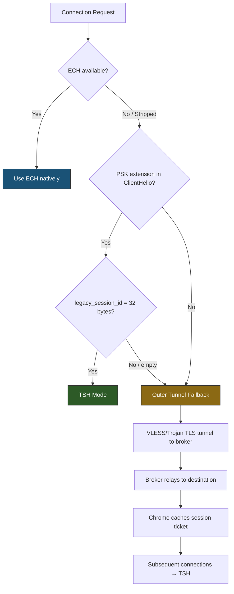

# TSH Broker — Detailed Architectural Specification

**Author:** Bingchen Gong ([@Wenri](https://github.com/Wenri))

This document is the engineering blueprint for the TSH (Transparent Single-Handshake) Broker. It specifies every byte offset, length field, and transformation step required for implementation.

---

## §1. Design Principles

TSH is a **transparent, non-terminating** TLS broker. It never decrypts TLS application data, never presents certificates, and never participates in key exchange. It operates purely at the byte level on serialized TLS handshake records, modifying opaque fields that carry no cryptographic commitment from the destination server.

**Core invariant:**

> `Restore(Transform(CH₀)) ≡ CH₀` — The server's restored ClientHello must be byte-identical to Chrome's original.

This invariant guarantees PSK binder verification succeeds at the destination, because the binder HMAC (RFC 8446 §4.2.11.2) covers the entire ClientHello transcript up to (but not including) the binders list. If the restored packet is byte-identical, the transcript hash is identical, and the binder is valid.

**Operational position:** TSH is an optimization layer, not standalone. It requires:
1. A fallback outer tunnel (VLESS/Trojan) for first-contact connections without PSK
2. ECH as the preferred defense when available (TSH activates only when ECH is stripped)



---

## §2. Cryptographic Specification

### 2.1 AEAD Parameters

| Parameter | Value | Notes |
|---|---|---|
| Algorithm | **GCM-SST** (primary) | Derives fresh GHASH subkeys per-nonce; resists Ferguson's subkey-recovery on short tags |
| Fallback | ChaCha20-Poly1305 (truncated) | If GCM-SST unavailable; Poly1305 has better truncation properties than GHASH |
| Key | 256-bit per-user PSK | Distributed out-of-band |
| Nonce | 12 bytes from `ClientHello.client_random[0:12]` | Publicly visible but unique per connection; zero wire overhead |
| Plaintext | 24 bytes (routing payload) | See §2.3 |
| Ciphertext | 24 bytes | Same length as plaintext |
| Auth tag | 8 bytes (truncated from 16) | GCM-SST: 2⁻⁶⁴ forgery per probe. Standard GCM would be n×2⁻³² with subkey leakage risk |
| Total | **32 bytes** | Fits exactly in `legacy_session_id` |

### 2.2 Session ID Wire Layout

```
Offset  Length  Field
──────  ──────  ─────────────────────────────
0       24      AEAD ciphertext (encrypted routing payload)
24       8      AEAD authentication tag (truncated)
──────  ──────  ─────────────────────────────
Total:  32      Replaces legacy_session_id content
```

### 2.3 Routing Payload Encoding (24 bytes plaintext)

```
Offset  Length  Field
──────  ──────  ─────────────────────────────
0       1       Flags byte:
                  Bits [0:1] — Mode:
                    00 = Raw domain (ASCII, null-terminated)
                    01 = Dictionary index
                    10 = IPv4 address
                    11 = IPv6 address
                  Bit  [2]   — Port:
                    0 = implicit 443
                    1 = explicit port (2 bytes follow mode data)
                  Bits [3:7] — Reserved (zero)

1       23      Mode-dependent data:
                  Raw:   Domain string ≤23 bytes, null-padded
                  Dict:  2-byte big-endian index + 21 bytes random padding
                  IPv4:  4-byte address [+ 2-byte port] + random padding
                  IPv6:  16-byte address [+ 2-byte port] + random padding
```

Random padding bytes are filled with cryptographically random data before encryption to prevent known-plaintext patterns in the ciphertext.

### 2.4 Key Distribution

```
tsh://broker.example.com?key=<base64url(256-bit PSK)>&covers=<domain1,domain2,...>
```

Per-user PSK, delivered via out-of-band channel (QR code, invite link). Periodic rotation recommended. The `covers` parameter lists available cover domains indexed by byte length.

---

## §3. TLS 1.3 Record Structure Reference

A TLS 1.3 ClientHello is wrapped in nested length-prefixed structures. Every byte offset matters for the length-fixup cascade.

### 3.1 Full Packet Envelope

```
Offset  Length  Field                          Adjustable?
──────  ──────  ─────────────────────────────  ───────────
0       1       ContentType = 0x16 (Handshake)
1       2       ProtocolVersion = 0x0301       
3       2       TLS Record Length (L_rec)       ✏️ YES
─── TLS Record Payload ───
5       1       HandshakeType = 0x01 (CH)      
6       3       Handshake Length (L_hs)         ✏️ YES
─── ClientHello Body ───
9       2       legacy_version = 0x0303        
11      32      client_random                   (nonce source)
43      1       legacy_session_id_length        (always 32 in compat mode)
44      32      legacy_session_id               ✏️ CARRIER FIELD
76      2       cipher_suites_length           
78      var     cipher_suites                  
var     1       compression_methods_length     
var     1       compression_methods = 0x00     
var     2       extensions_length (L_ext)       ✏️ YES
─── Extensions ───
var     var     Extension 1..N (including SNI, padding, PSK)
```

### 3.2 SNI Extension (type 0x0000) Internal Structure

```
Offset  Length  Field
──────  ──────  ──────────────────────────────
0       2       Extension type = 0x0000
2       2       Extension data length (L_sni_ext)     ✏️ YES (if Δ≠0)
4       2       Server name list length (L_sni_list)   ✏️ YES (if Δ≠0)
6       1       Name type = 0x00 (host_name)
7       2       Host name length (L_hostname)           ✏️ YES (if Δ≠0)
9       var     Host name bytes (ASCII)                 ✏️ OVERWRITE
```

**With length-matched cover domains, Δ = 0 and only the hostname bytes change. No SNI length fields need adjustment.**

### 3.3 Padding Extension (type 0x0015) Internal Structure

```
Offset  Length  Field
──────  ──────  ──────────────────────────────
0       2       Extension type = 0x0015
2       2       Extension data length (L_pad)   ✏️ YES (reduce by 32)
4       var     Padding bytes (all zeros)       ✏️ TRUNCATE by 32
```

### 3.4 Pre-Shared Key Extension (type 0x0029) — Must Be Last

```
Offset  Length  Field
──────  ──────  ──────────────────────────────
0       2       Extension type = 0x0029
2       2       Extension data length (L_psk_ext)      ✏️ YES (+32)
─── Identities List ───
4       2       Identities list length (L_ids)          ✏️ YES (+32)
6       2       Identity 1 length (L_id1)               ✏️ YES (+32)
8       var     Identity 1 opaque data (ticket)         ✏️ APPEND 32 bytes
var     4       obfuscated_ticket_age_1                 (DO NOT TOUCH)
var     ...     [Identity 2..N if present]
─── Binders List ───
var     2       Binders list length
var     1       Binder 1 length
var     var     Binder 1 value (HMAC)                   (DO NOT TOUCH)
var     ...     [Binder 2..N if present]
```

> [!CAUTION]
> The `obfuscated_ticket_age` (4 bytes) immediately follows each identity's opaque data. When appending 32 bytes to the identity, the identity length field `L_id1` must increase by exactly 32. The `obfuscated_ticket_age` does NOT move — the appended bytes go before it in the identity's opaque blob. The server must snip the last 32 bytes of the opaque blob (just before `obfuscated_ticket_age`) when restoring.

**Correction — actual PSK identity structure per RFC 8446:**

```c
struct {
    opaque identity<1..2^16-1>;     // length-prefixed opaque blob
    uint32 obfuscated_ticket_age;   // immediately after the blob
} PskIdentity;
```

The `identity` field has its own 2-byte length prefix (`L_id1`). Appending 32 bytes means:
1. The 32 bytes are added to the end of the `identity` opaque data
2. `L_id1` increases by 32
3. `obfuscated_ticket_age` shifts 32 bytes forward in the packet
4. `L_ids` increases by 32
5. `L_psk_ext` increases by 32

---

## §4. Client-Side Transform — Byte-Level Algorithm

### 4.1 Input

Raw TCP payload containing a single TLS record: a ClientHello with PSK extension.

### 4.2 Parse Phase

```python
# 1. Read TLS record header
content_type     = buf[0]        # must be 0x16
tls_version      = buf[1:3]      # 0x0301
L_rec            = u16(buf[3:5])
# Offsets below are relative to buf[5] (handshake message start)

# 2. Read handshake header  
hs_type          = buf[5]        # must be 0x01
L_hs             = u24(buf[6:9])

# 3. Read ClientHello fixed fields
legacy_ver       = buf[9:11]
client_random    = buf[11:43]    # → nonce = client_random[0:12]
sid_len          = buf[43]       # must be 32
session_id       = buf[44:76]    # → R (save this)

# 4. Skip cipher_suites and compression_methods
cs_len           = u16(buf[76:78])
cs_end           = 78 + cs_len
comp_len         = buf[cs_end]
comp_end         = cs_end + 1 + comp_len

# 5. Read extensions
L_ext            = u16(buf[comp_end:comp_end+2])
ext_start        = comp_end + 2

# 6. Walk extensions to find SNI, padding, PSK
for each extension at offset p:
    ext_type     = u16(buf[p:p+2])
    ext_len      = u16(buf[p+2:p+4])
    if ext_type == 0x0000:  sni_offset = p      # SNI
    if ext_type == 0x0015:  pad_offset = p      # Padding  
    if ext_type == 0x0029:  psk_offset = p      # PSK (must be last)
    p += 4 + ext_len
```

### 4.3 Transform Phase

```python
# Step 1: Save original Session ID
R = buf[44:76]                              # 32 bytes

# Step 2: Encrypt routing payload
nonce     = client_random[0:12]
plaintext = encode_payload(target_domain)   # 24 bytes (§2.3)
ct, tag   = AEAD_encrypt(key, nonce, plaintext, aad=b"")
C         = ct + tag[0:8]                   # 32 bytes total

# Step 3: Inject into Session ID
buf[44:76] = C

# Step 4: Overwrite SNI hostname (length-matched, Δ=0)
hostname_offset = sni_offset + 9            # past ext header + list header + type + len
hostname_len    = u16(buf[sni_offset+7:sni_offset+9])
cover_domain    = select_cover(len=hostname_len)  # same byte length
buf[hostname_offset:hostname_offset+hostname_len] = cover_domain.encode()

# Step 5: Append R to first PSK identity
# Find first identity inside PSK extension
ids_len_offset  = psk_offset + 4
ids_len         = u16(buf[ids_len_offset:ids_len_offset+2])
id1_len_offset  = ids_len_offset + 2
id1_len         = u16(buf[id1_len_offset:id1_len_offset+2])
id1_data_start  = id1_len_offset + 2
id1_data_end    = id1_data_start + id1_len
# obfuscated_ticket_age starts at id1_data_end (4 bytes)

# Insert R at id1_data_end (before obfuscated_ticket_age)
buf = buf[:id1_data_end] + R + buf[id1_data_end:]

# Step 6: Fix PSK length fields
write_u16(buf, id1_len_offset,  id1_len + 32)    # identity length
write_u16(buf, ids_len_offset,  ids_len + 32)     # identities list length
psk_ext_len = u16(buf[psk_offset+2:psk_offset+4])
write_u16(buf, psk_offset + 2,  psk_ext_len + 32) # PSK extension data length

# Step 7: Compensate with padding extension (absorb +32)
if pad_offset is not None:
    pad_ext_len = u16(buf[pad_offset+2:pad_offset+4])
    if pad_ext_len >= 32:
        # Shrink padding by 32 bytes
        pad_data_start = pad_offset + 4
        buf = buf[:pad_data_start + pad_ext_len - 32] + buf[pad_data_start + pad_ext_len:]
        write_u16(buf, pad_offset + 2, pad_ext_len - 32)
        net_delta = 0   # +32 (PSK) - 32 (padding) = 0
    else:
        net_delta = 32  # cannot fully absorb
else:
    net_delta = 32

# Step 8: Fix envelope lengths
L_ext_offset = comp_end
write_u16(buf, L_ext_offset, u16(buf[L_ext_offset:L_ext_offset+2]) + net_delta)
write_u24(buf, 6,  u24(buf[6:9]) + net_delta)     # Handshake length
write_u16(buf, 3,  u16(buf[3:5]) + net_delta)      # TLS Record length
```

### 4.4 ServerHello Return-Path Interception

When a ServerHello arrives from the broker server:

```python
# ServerHello structure:
# buf[0]    = 0x16 (Handshake)
# buf[5]    = 0x02 (ServerHello)
# buf[43]   = session_id_length (should be 32)
# buf[44:76] = session_id (contains ciphertext C, injected by broker server)

# Restore original Session ID for Chrome
buf[44:76] = R   # R was saved during Transform
# No length changes needed (32→32 swap)
```

---

## §5. Server-Side Restore — Byte-Level Algorithm

### 5.1 Authenticate & Decrypt

```python
# Read from incoming ClientHello
client_random   = buf[11:43]
nonce           = client_random[0:12]
C               = buf[44:76]           # 32 bytes: 24 ct + 8 tag

ct   = C[0:24]
tag  = C[24:32]

# Verify and decrypt
plaintext = AEAD_decrypt(key, nonce, ct, tag, aad=b"")
if plaintext is None:
    # MAC verification failed → active probe or random connection
    # Serve real website for cover domain (genuine TLS handshake)
    return serve_cover_website(buf)

target = decode_payload(plaintext)   # e.g., "youtube.com"
```

### 5.2 Restore Phase (Exact Reversal of Transform)

```python
# Step 1: Extract hidden R from PSK identity tail
ids_len_offset = psk_offset + 4
id1_len_offset = ids_len_offset + 2
id1_len        = u16(buf[id1_len_offset:id1_len_offset+2])
id1_data_start = id1_len_offset + 2
id1_data_end   = id1_data_start + id1_len
# R is the last 32 bytes of identity opaque data
R = buf[id1_data_end - 32 : id1_data_end]

# Step 2: Remove the appended 32 bytes
buf = buf[:id1_data_end - 32] + buf[id1_data_end:]

# Step 3: Fix PSK length fields (-32)
write_u16(buf, id1_len_offset, id1_len - 32)
ids_len = u16(buf[ids_len_offset:ids_len_offset+2])
write_u16(buf, ids_len_offset, ids_len - 32)
psk_ext_len = u16(buf[psk_offset+2:psk_offset+4])
write_u16(buf, psk_offset + 2, psk_ext_len - 32)

# Step 4: Restore Session ID
buf[44:76] = R

# Step 5: Restore SNI hostname
hostname_offset = sni_offset + 9
hostname_len    = u16(buf[sni_offset+7:sni_offset+9])
buf[hostname_offset:hostname_offset+hostname_len] = target.encode()
# Length-matched → no SNI length field changes

# Step 6: Restore padding extension (+32)
if pad_offset is not None:
    pad_ext_len = u16(buf[pad_offset+2:pad_offset+4])
    pad_data_end = pad_offset + 4 + pad_ext_len
    buf = buf[:pad_data_end] + bytes(32) + buf[pad_data_end:]
    write_u16(buf, pad_offset + 2, pad_ext_len + 32)
    net_delta = 0
else:
    net_delta = -32

# Step 7: Fix envelope lengths
write_u16(buf, L_ext_offset, u16(buf[L_ext_offset:L_ext_offset+2]) + net_delta)
write_u24(buf, 6, u24(buf[6:9]) + net_delta)
write_u16(buf, 3, u16(buf[3:5]) + net_delta)

# ASSERTION: buf is now byte-identical to Chrome's original CH₀
```

### 5.3 ServerHello Patching (Outbound to Client)

When the destination responds with a ServerHello:

```python
# Destination echoes original Session ID R in ServerHello
# GFW expects to see ciphertext C (what it saw in ClientHello)
# Replace R → C in ServerHello for GFW consistency

buf_sh[44:76] = C   # C was read during authentication
# No length changes (32→32 swap)
```

### 5.4 Post-Handshake Relay

After the ServerHello patch, all subsequent TLS records are relayed as opaque TCP between client and destination with no further modification. The broker has no visibility into encrypted application data.

---

## §6. Length Fixup Cascade — Complete Reference

With length-matched cover domains (Δ_SNI = 0) and sufficient padding (≥32 bytes):

| Field | Location | Delta | Net |
|---|---|---|---|
| PSK Identity 1 length | `psk_offset + 6` | +32 | +32 |
| PSK Identities list length | `psk_offset + 4` | +32 | +32 |
| PSK Extension data length | `psk_offset + 2` | +32 | +32 |
| Padding Extension data length | `pad_offset + 2` | −32 | 0 |
| Extensions total length | `comp_end` | 0 | 0 |
| Handshake length | byte 6 (3-byte) | 0 | 0 |
| TLS Record length | byte 3 (2-byte) | 0 | 0 |

**Result: Total packet size is unchanged.** This is the strongest anti-fingerprint property — not even the packet length changes.

Without padding compensation (no padding extension, or padding < 32):

| Field | Delta |
|---|---|
| PSK Identity/Extension lengths | +32 |
| Extensions total length | +32 |
| Handshake length | +32 |
| TLS Record length | +32 |

---

## §7. Cover Domain Infrastructure

### 7.1 Requirements

The broker operator controls all cover domains. No third-party domain impersonation.

| Property | Specification |
|---|---|
| Ownership | Registered and controlled by broker operator |
| Certificate | Valid Let's Encrypt (or equivalent) TLS certificate |
| Website | Real static site served as default for all non-TSH connections |
| IP plausibility | Hosted on CDN/cloud IPs where many domains coexist |
| TLS 1.3 + PSK | Server must support session resumption |
| Length pool | Multiple domains covering common target domain byte lengths |

### 7.2 Active Probe Defense

```
Incoming connection:
├── AEAD MAC verifies?
│   ├── YES → TSH client, proceed with Restore
│   └── NO  → Not a TSH client (prober or legitimate visitor)
│       ├── Valid TLS ClientHello?
│       │   ├── YES → Complete genuine TLS handshake for cover domain
│       │   │         Serve real website, maintain plausible session duration
│       │   └── NO  → Behave as standard TCP timeout (kernel RST)
│       └── Rate limit: >5 failed MACs from same IP/60s → blocklist
```

The broker is indistinguishable from a real web server because it **is** a real web server.

---

## §8. Edge Cases and Error Handling

### 8.1 HelloRetryRequest

If the destination sends HRR instead of ServerHello:
1. Broker relays HRR back through the tunnel to client
2. Chrome generates a **new** ClientHello with a **new** `client_random`
3. TSH client engine re-applies Transform with the new `client_random[0:12]` as nonce
4. TSH is stateless per-ClientHello — no session state to corrupt

### 8.2 Multiple PSK Identities

Chrome may offer 1–2 PSK identities. TSH always operates on the **first** identity in the list (simplest parsing, most reliable). The 32 hidden bytes are appended to Identity 1's opaque data.

### 8.3 Missing Padding Extension

If no padding extension exists, the +32 byte increase propagates to all envelope lengths. The total ClientHello grows by 32 bytes. This is acceptable — PSK-resumption ClientHellos vary in size across servers.

### 8.4 ClientHello Fragmentation

If the ClientHello spans multiple TLS records (rare but possible for very large extension lists), the client engine must reassemble into a single buffer before Transform, then re-fragment identically after.

### 8.5 Session ID Not 32 Bytes

If `legacy_session_id_length ≠ 32` (client not in compatibility mode), TSH cannot activate. Fall back to outer tunnel immediately.

---

## §9. Threat Model

| Threat | Defense | Residual Risk | Severity |
|---|---|---|---|
| SNI-based filtering | Broker-controlled cover domain | Cover domain blocked (rotate pool) | Low |
| JA3/JA4 fingerprinting | Extension order/IDs preserved | None | None |
| Entropy analysis on Session ID | AEAD ciphertext ≡ Chrome's random bytes | None | None |
| Stateful DPI (CH↔SH correlation) | Bidirectional ServerHello patching | Implementation error | Medium |
| Active probing | Real website served on cover domain | Probe sophistication | Low |
| IP ↔ domain mismatch | CDN/cloud IP deployment | Infrastructure planning | Medium |
| PSK ticket size anomaly | +32B within 100–500B normal range | Statistical analysis | Low |
| Tag forgery | GCM-SST 8-byte tag → 2⁻⁶⁴/probe | Negligible | Negligible |
| Binder integrity at destination | Byte-perfect restoration (tested) | Off-by-one in implementation | **High** |
| Key compromise | Per-user PSK, periodic rotation | Out-of-band bootstrap | Medium |
| Chrome drops compat mode | `legacy_session_id` becomes empty | Long-term fragility | Medium |
| GFW strips PSK extension | Hidden Session ID destroyed | **Kill condition**, no mitigation | **Critical** |
| ECH deployed and working | TSH becomes unnecessary | Not a threat — desired outcome | None |

---

## §10. Verification Plan

### 10.1 Transform/Restore Byte-Identity Test

```
Input:  Corpus of 1000+ real Chrome ClientHello packets (captured via TUN/TAP)
        Various destinations, Chrome versions, ticket counts, extension orders

Test:   For each CH₀:
        1. CH₁ = Transform(CH₀, key, cover_domain)
        2. CH₂ = Restore(CH₁, key)
        3. ASSERT CH₂ == CH₀ byte-for-byte
        4. On failure: report divergent byte offset and field name
```

### 10.2 Live Handshake Validation

Forward restored `CH₂` to the actual destination server over TCP. Verify:
- No TLS alert received
- ServerHello received (binder accepted)
- Full handshake completes
- Application data exchange succeeds

### 10.3 Fuzz Testing

Boundary cases to exercise:
- SNI lengths 1–253 bytes
- PSK identity counts 1, 2, 3
- Padding extension present/absent, padding length 0–512
- Ticket sizes 32–600 bytes
- Extension order permutations (Chrome GREASE randomization)

### 10.4 Active Probe Resistance

1. Random bytes → verify cover website served
2. Valid TLS ClientHello with wrong MAC → verify cover website served
3. Replayed ClientHello → verify graceful handling
4. Rapid connection cycling from same IP → verify rate limiting triggers
