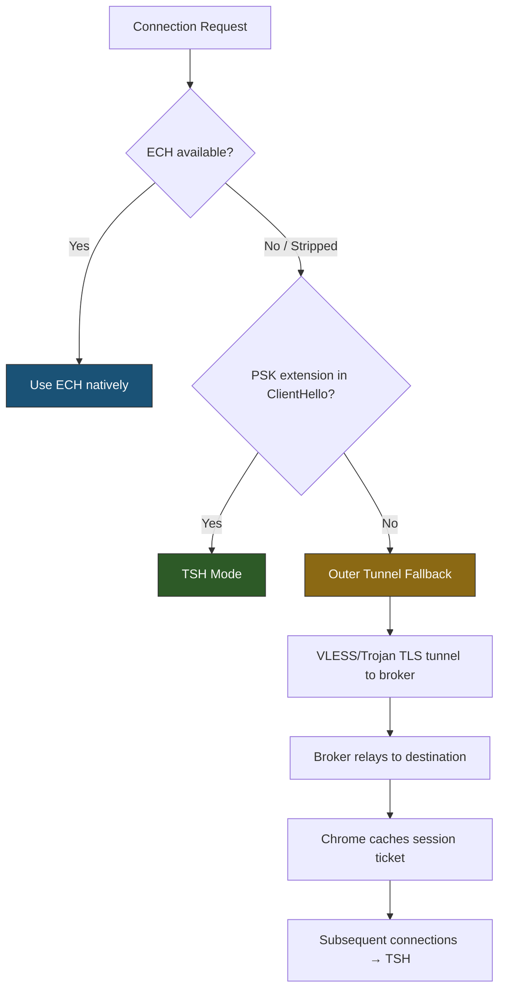

# TSH Broker — Detailed Architectural Specification (v4)

**Author:** Bingchen Gong ([@Wenri](https://github.com/Wenri))

This document is the engineering blueprint for the TSH (Transparent Single-Handshake) Broker v4 ("Direct Ticket Injection"). It specifies every byte offset, length field, and transformation step required for implementation.

---

## §1. Design Principles

TSH is a **transparent, non-terminating, stateless** TLS broker. It never decrypts TLS application data, never presents certificates, and never participates in key exchange. It operates purely at the byte level on serialized TLS handshake records, modifying only the PSK ticket (opaque), SNI hostname, and padding extension.

**Core invariant:**

> `Restore(Transform(CH₀)) ≡ CH₀` — The broker's restored ClientHello must be byte-identical to Chrome's original.

**v4 key design decisions:**

| Decision | Rationale |
|---|---|
| **Never modify `legacy_session_id`** | Eliminates ServerHello echo mismatch; broker needs no return-path interception |
| **Fresh 12-byte CSPRNG nonce** | RFC 8446 §4.1.2 mandates same `client_random` across HRR; reusing it as nonce causes catastrophic two-time pad |
| **Encode `P₀` explicitly in payload** | Eliminates client/server padding ambiguity — broker always knows exact original padding |
| **Full 16-byte Poly1305 tag** | Unbounded ticket space removes need for tag truncation; immune to Ferguson's subkey attack |
| **Single cover domain** | Dynamic padding absorption handles all length deltas; no domain pool maintenance |

**Operational position:**



---

## §2. Cryptographic Specification

### 2.1 AEAD Parameters

| Parameter | Value | Notes |
|---|---|---|
| Algorithm | **ChaCha20-Poly1305** | Natively in Go (`x/crypto`), Rust (`ring`), full security, no truncation weakness |
| Key | 256-bit per-user PSK | Distributed out-of-band |
| Nonce | 12 bytes **fresh CSPRNG** per Transform | NOT derived from `client_random` — immune to HRR nonce reuse |
| Tag | 16 bytes (full) | 2⁻¹²⁸ forgery probability per probe |

### 2.2 Encrypted Routing Data (ERD) — Appended to PSK Ticket Tail

```
Offset  Length  Field
──────  ──────  ─────────────────────────────
0       2       ERD total length (big-endian, includes all fields below)
2       12      Nonce (fresh CSPRNG)
14      var     Ciphertext (encrypted plaintext payload)
var     16      Poly1305 authentication tag
──────  ──────  ─────────────────────────────
Total:  30 + len(plaintext)
```

The 2-byte ERD length header at the start allows the broker to know exactly how many bytes to read from the ticket tail without ambiguity.

### 2.3 Plaintext Payload (encrypted inside ERD ciphertext)

```
Offset  Length  Field
──────  ──────  ─────────────────────────────
0       2       Original padding length P₀ (big-endian)
2       var     Target domain (null-terminated ASCII)
```

No Huffman, no dictionary, no IPv4/IPv6 modes. The domain is simply stored as-is. Typical total: 2 + domain_len + 1 (null terminator).

Example for `youtube.com`: 2 + 11 + 1 = 14 bytes plaintext → ERD = 2 + 12 + 14 + 16 = 44 bytes appended to ticket.

### 2.4 Key Distribution

```
tsh://broker.example.com?key=<base64url(256-bit PSK)>&cover=<domain>
```

---

## §3. TLS 1.3 Record Structure — Fields TSH Touches

### 3.1 Full Packet Envelope

```
Offset  Length  Field                          TSH v4 Action
──────  ──────  ─────────────────────────────  ──────────────
0       1       ContentType = 0x16
1       2       ProtocolVersion = 0x0301
3       2       TLS Record Length (L_rec)       ✏️ adjust
5       1       HandshakeType = 0x01
6       3       Handshake Length (L_hs)         ✏️ adjust
9       2       legacy_version = 0x0303
11      32      client_random                   READ ONLY (not used as nonce)
43      1       legacy_session_id_length        ❌ DO NOT TOUCH
44      32      legacy_session_id               ❌ DO NOT TOUCH
76      2       cipher_suites_length
78      var     cipher_suites
var     1       compression_methods_length
var     1       compression_methods = 0x00
var     2       extensions_length (L_ext)       ✏️ adjust
```

### 3.2 SNI Extension (type 0x0000)

```
Offset  Length  Field                          TSH v4 Action
──────  ──────  ──────────────────────────────  ──────────────
+0      2       Extension type = 0x0000
+2      2       Extension data length           ✏️ adjust (Δ_SNI)
+4      2       Server name list length         ✏️ adjust (Δ_SNI)
+6      1       Name type = 0x00
+7      2       Host name length                ✏️ adjust (Δ_SNI)
+9      var     Host name bytes (ASCII)         ✏️ OVERWRITE
```

Where `Δ_SNI = len(cover_domain) - len(target_domain)`.

### 3.3 Padding Extension (type 0x0015)

```
Offset  Length  Field                          TSH v4 Action
──────  ──────  ──────────────────────────────  ──────────────
+0      2       Extension type = 0x0015
+2      2       Extension data length (P)       ✏️ shrink by Δ_total
+4      var     Padding bytes (all zeros)       ✏️ TRUNCATE by Δ_total
```

### 3.4 Pre-Shared Key Extension (type 0x0029) — Must Be Last

```
Offset  Length  Field                          TSH v4 Action
──────  ──────  ──────────────────────────────  ──────────────
+0      2       Extension type = 0x0029
+2      2       Extension data length           ✏️ +len(ERD)
+4      2       Identities list length          ✏️ +len(ERD)
+6      2       Identity 1 length (L_id1)       ✏️ +len(ERD)
+8      var     Identity 1 opaque data          ✏️ APPEND ERD at tail
var     4       obfuscated_ticket_age_1         ❌ DO NOT TOUCH
var     ...     [Identity 2..N if present]
var     2       Binders list length             ❌ DO NOT TOUCH
var     var     Binder values                   ❌ DO NOT TOUCH
```

> [!CAUTION]
> The ERD is appended to the **end of the identity opaque data**, just before `obfuscated_ticket_age`. The identity length field `L_id1` increases by `len(ERD)`. The `obfuscated_ticket_age` (4 bytes) **shifts forward** in the packet by `len(ERD)` bytes. The broker must account for this shift when parsing.

---

## §4. Client-Side Transform — Byte-Level Algorithm

### 4.1 Parse Phase

```python
# Standard ClientHello parsing (same as v3 §4.2)
# Walk extensions to find: sni_offset, pad_offset, psk_offset
# Record: hostname_len, target_domain, pad_data_len (P₀)
```

### 4.2 Transform Phase

```python
# Step 1: Record original padding
P₀ = pad_data_len if pad_offset is not None else 0

# Step 2: Encrypt routing payload
nonce     = os.urandom(12)                          # FRESH per Transform
plaintext = u16_be(P₀) + target_domain + b'\x00'   # 2 + domain + NUL
ct, tag   = ChaCha20Poly1305_encrypt(key, nonce, plaintext, aad=b"")
erd       = u16_be(2+12+len(ct)+16) + nonce + ct + tag  # 2-byte length header
erd_len   = len(erd)

# Step 3: Append ERD to first PSK identity
id1_data_end = id1_data_start + id1_len  # end of opaque data, before ticket_age
buf = buf[:id1_data_end] + erd + buf[id1_data_end:]

# Step 4: Fix PSK length fields (+erd_len)
write_u16(buf, id1_len_offset,  id1_len + erd_len)
write_u16(buf, ids_len_offset,  ids_len + erd_len)
write_u16(buf, psk_offset + 2,  psk_ext_len + erd_len)

# Step 5: Overwrite SNI hostname
Δ_SNI = len(cover_domain) - len(target_domain)
# Resize the hostname region
hostname_start = sni_offset + 9
buf = buf[:hostname_start] + cover_domain.encode() + buf[hostname_start + hostname_len:]
# Fix SNI internal lengths
write_u16(buf, sni_offset + 7, len(cover_domain))   # hostname length
write_u16(buf, sni_offset + 4, u16(buf[sni_offset+4:sni_offset+6]) + Δ_SNI)  # list length
write_u16(buf, sni_offset + 2, u16(buf[sni_offset+2:sni_offset+4]) + Δ_SNI)  # ext data length

# Step 6: Compute total delta and absorb with padding
Δ_total = erd_len + Δ_SNI   # net bytes added to extensions

if pad_offset is not None and P₀ >= Δ_total and Δ_total > 0:
    # Shrink padding to absorb
    pad_data_start = pad_offset + 4
    buf = buf[:pad_data_start + P₀ - Δ_total] + buf[pad_data_start + P₀:]
    write_u16(buf, pad_offset + 2, P₀ - Δ_total)
    net_delta = 0
elif pad_offset is not None and Δ_total > 0:
    # Padding too small — shrink to 0, accept partial absorption
    pad_data_start = pad_offset + 4
    buf = buf[:pad_data_start] + buf[pad_data_start + P₀:]
    write_u16(buf, pad_offset + 2, 0)
    net_delta = Δ_total - P₀
else:
    net_delta = Δ_total

# Step 7: Fix envelope lengths
L_ext_offset = comp_end
write_u16(buf, L_ext_offset, u16(buf[L_ext_offset:L_ext_offset+2]) + net_delta)
write_u24(buf, 6,  u24(buf[6:9]) + net_delta)
write_u16(buf, 3,  u16(buf[3:5]) + net_delta)
```

### 4.3 HRR Handling

If Chrome resends a ClientHello after HRR:
- `client_random` is the same (RFC 8446 mandate) — **but we don't use it as nonce**
- `os.urandom(12)` generates a **fresh nonce** → no nonce reuse
- Transform is re-applied independently on the new ClientHello

### 4.4 Return Path

**No action required.** The ServerHello passes through unmodified because `legacy_session_id` was never changed. The destination echoes Chrome's original `R` naturally. The GFW sees `R` in both directions — perfect match.

---

## §5. Server-Side (Broker) Restore — Byte-Level Algorithm

### 5.1 Authenticate & Decrypt

```python
# Parse ClientHello, locate PSK extension, first identity
id1_len        = u16(buf[id1_len_offset:id1_len_offset+2])
id1_data_start = id1_len_offset + 2
id1_data_end   = id1_data_start + id1_len

# Read ERD length header from ticket tail
erd_len_offset = id1_data_end - 2  # ... actually, read from end
# Strategy: read last 2 bytes of identity to get a candidate ERD length,
# then validate by reading the ERD structure

# More robust: scan backward from id1_data_end
erd_total_len  = u16(buf[id1_data_end - ???])  # Need a marker

# PREFERRED: The ERD length header is at a KNOWN position.
# Since ERD was APPENDED, its 2-byte length header is at:
#   id1_data_end - erd_total_len
# But we don't know erd_total_len yet. Solution:
# The 2-byte ERD length is the FIRST field of the ERD block.
# The broker knows the per-user key, so it can try:
#   Read the last 2 bytes of the identity as a candidate length
#   This doesn't work because the last field is the tag.

# REVISED APPROACH: Put the 2-byte ERD length at the VERY END (after tag):
# ERD = [nonce(12)] [ciphertext(var)] [tag(16)] [erd_total_len(2)]
# Broker reads last 2 bytes of identity → erd_total_len
# Then reads backward to extract nonce, ct, tag.

erd_total_len = u16(buf[id1_data_end - 2 : id1_data_end])
erd_start     = id1_data_end - erd_total_len
nonce         = buf[erd_start : erd_start + 12]
ct            = buf[erd_start + 12 : id1_data_end - 2 - 16]
tag           = buf[id1_data_end - 2 - 16 : id1_data_end - 2]

plaintext = ChaCha20Poly1305_decrypt(key, nonce, ct, tag, aad=b"")
if plaintext is None:
    return serve_cover_website(buf)  # MAC failed → active probe defense

P₀     = u16_be(plaintext[0:2])
target = plaintext[2:].split(b'\x00')[0].decode()
```

**Revised ERD layout (length trailer):**

```
Offset  Length  Field
──────  ──────  ─────────────────────────────
0       12      Nonce
12      var     Ciphertext
var     16      Poly1305 tag
var     2       ERD total length (trailer, big-endian)
──────  ──────  ─────────────────────────────
Total:  30 + len(plaintext)
```

The 2-byte length trailer at the **end** lets the broker read the last 2 bytes of the identity to immediately know the ERD size.

### 5.2 Restore Phase

```python
erd_len = erd_total_len  # includes the 2-byte trailer itself

# Step 1: Remove ERD from PSK identity
buf = buf[:id1_data_end - erd_len] + buf[id1_data_end:]

# Step 2: Fix PSK length fields (-erd_len)
write_u16(buf, id1_len_offset, id1_len - erd_len)
write_u16(buf, ids_len_offset, ids_len - erd_len)
write_u16(buf, psk_offset + 2, psk_ext_len - erd_len)

# Step 3: Restore SNI
cover_domain = current SNI hostname from buf
Δ_SNI = len(cover_domain) - len(target)
hostname_start = sni_offset + 9
buf = buf[:hostname_start] + target.encode() + buf[hostname_start + len(cover_domain):]
write_u16(buf, sni_offset + 7, len(target))
write_u16(buf, sni_offset + 4, u16(buf[sni_offset+4:sni_offset+6]) - Δ_SNI)
write_u16(buf, sni_offset + 2, u16(buf[sni_offset+2:sni_offset+4]) - Δ_SNI)

# Step 4: Restore padding to EXACTLY P₀
if pad_offset is not None:
    current_pad = u16(buf[pad_offset+2:pad_offset+4])
    pad_data_start = pad_offset + 4
    if P₀ > current_pad:
        # Need to ADD padding bytes
        add = P₀ - current_pad
        buf = buf[:pad_data_start + current_pad] + bytes(add) + buf[pad_data_start + current_pad:]
    elif P₀ < current_pad:
        # Need to REMOVE padding bytes
        rm = current_pad - P₀
        buf = buf[:pad_data_start + P₀] + buf[pad_data_start + current_pad:]
    write_u16(buf, pad_offset + 2, P₀)

# Step 5: Compute net delta and fix envelope lengths
# All changes are known: -erd_len (PSK), -Δ_SNI (SNI), +(P₀ - current_pad) (padding)
net_delta = -erd_len - Δ_SNI + (P₀ - current_pad)
# net_delta should be 0 if the client's Δ_total was fully absorbed.
# If not, it will be negative (packet shrinks back to original size).

write_u16(buf, L_ext_offset, u16(buf[L_ext_offset:L_ext_offset+2]) + net_delta)
write_u24(buf, 6, u24(buf[6:9]) + net_delta)
write_u16(buf, 3, u16(buf[3:5]) + net_delta)

# ASSERTION: buf == CH₀ (byte-identical to Chrome's original)
```

### 5.3 Post-Forward

After forwarding `CH₀`, the broker enters **zero-copy TCP relay**. No ServerHello interception, no Session ID patching, no per-connection state. All data flows through the kernel (`splice()` / `sendfile()`).

---

## §6. Length Fixup Cascade — Complete Reference

With a single cover domain and full padding absorption (P₀ ≥ Δ_total):

| Field | Delta | Net |
|---|---|---|
| PSK Identity 1 length | +erd_len | +erd_len |
| PSK Identities list length | +erd_len | +erd_len |
| PSK Extension data length | +erd_len | +erd_len |
| SNI hostname length | +Δ_SNI | +Δ_SNI |
| SNI list length | +Δ_SNI | +Δ_SNI |
| SNI extension data length | +Δ_SNI | +Δ_SNI |
| Padding data length | -(erd_len + Δ_SNI) | absorbs all |
| **Extensions total** | **0** | **0** |
| **Handshake length** | **0** | **0** |
| **TLS Record length** | **0** | **0** |

**Result: Total packet size unchanged** when padding can fully absorb.

---

## §7. Cover Domain & Active Probe Defense

### 7.1 Single Cover Domain

TSH v4 requires only **one** cover domain. The broker operator registers a benign domain, obtains a Let's Encrypt certificate, and hosts a real static website.

### 7.2 Active Probe Defense

```
Incoming connection:
├── Parse ClientHello, locate PSK identity
├── Read ERD from ticket tail
├── AEAD MAC verifies?
│   ├── YES → TSH client, proceed with Restore
│   └── NO  → Not a TSH client
│       ├── Valid TLS ClientHello? → Serve real website (genuine TLS handshake)
│       └── Not TLS? → Kernel TCP timeout (RST)
└── Rate limit: >5 failed MACs/IP/60s → blocklist
```

---

## §8. Edge Cases

### 8.1 HelloRetryRequest

1. Broker relays HRR through the tunnel to client
2. Chrome generates new ClientHello (same `client_random`, different `key_share`)
3. TSH client generates **fresh 12-byte CSPRNG nonce** → new ERD
4. No nonce reuse — cryptographically safe

### 8.2 No Padding Extension

If Chrome sends no padding extension, `P₀ = 0`. The client cannot absorb the delta; the packet grows by `erd_len + Δ_SNI`. This is acceptable — PSK resumption ClientHellos vary by hundreds of bytes.

### 8.3 TLS 1.2 Fallback

If the destination rejects PSK and negotiates TLS 1.2, it sends a standard ServerHello. Since TSH v4 never modified `legacy_session_id`, the ServerHello format is irrelevant — it passes through unmodified regardless of TLS version.

### 8.4 Multiple PSK Identities

TSH operates on the **first** identity. Other identities and all binders are untouched.

---

## §9. Threat Model

| Threat | Defense | Residual Risk | Severity |
|---|---|---|---|
| SNI-based filtering | Broker-controlled cover domain | Cover domain blocked | Low |
| JA3/JA4 fingerprinting | Extension order/IDs preserved | None | None |
| Entropy analysis | Session ID = genuine Chrome random | None | None |
| Stateful DPI (CH↔SH) | Session ID never modified → natural match | None | None |
| Active probing | Real website served | Probe sophistication | Low |
| Ticket size anomaly | +44B within 100–500B normal range | Statistical analysis | Low |
| Tag forgery | Full Poly1305 (2⁻¹²⁸) | Negligible | Negligible |
| Binder integrity | Byte-perfect restoration with explicit P₀ | Implementation error | **High** |
| HRR nonce reuse | Fresh CSPRNG per Transform | None | None |
| GFW strips PSK | **Kill condition** — no mitigation | Total | **Critical** |

---

## §10. Verification Plan

### 10.1 Transform/Restore Byte-Identity Test

```
Corpus: 1000+ real Chrome ClientHello packets
Test:   For each CH₀: Assert Restore(Transform(CH₀)) == CH₀
Fail:   Report divergent byte offset and field name
```

### 10.2 HRR Nonce Safety Test

```
1. Transform CH₀ → CH₁ (nonce N₁)
2. Simulate HRR: Chrome resends CH₀' (same client_random, different key_share)
3. Transform CH₀' → CH₁' (nonce N₂)
4. ASSERT N₁ ≠ N₂ (fresh CSPRNG guarantees this)
5. ASSERT: no keystream reuse between CH₁ and CH₁'
```

### 10.3 Fuzz Testing

- Varying SNI lengths (1–253 bytes)
- Padding extension present/absent, length 0–512
- Multiple PSK identities (1, 2, 3)
- Ticket sizes 32–600 bytes
- Extension order permutations
